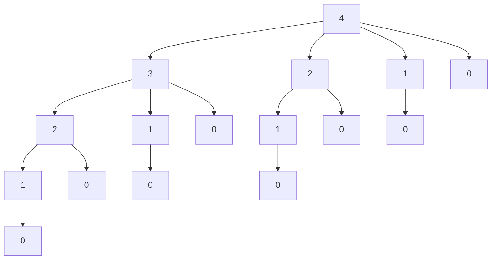
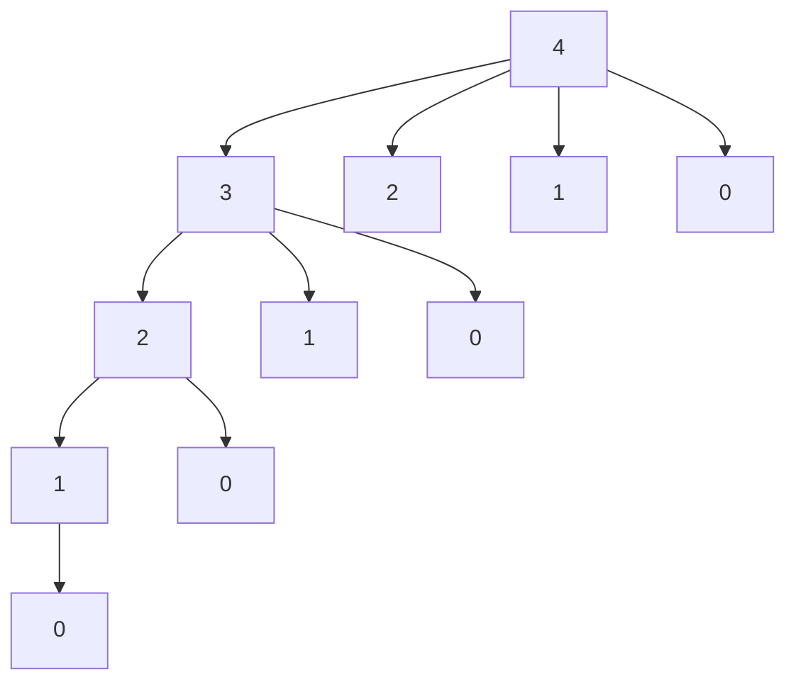

2024-11-30 16:21

Status:

Tags: #ProgrammingConcepts 

# Dynamic Programming
Dynamic programming (or **DP**) is a technique used to optimize the Time and Space complexity of recursive algorithms. The larger problem is divided into smaller "repeated subproblems" which we solve individually. These solutions are then saved and reused, rather than recalculated, preventing us from doing the same work more than once. There are two main types of DP:
- **Top Down:** Start with the original problem and recursively work down to the base cases. 
	- *Memoization:* Saves the result of each subproblem and reuses them when applicable
	- Is often easier to implement than the "bottom up" version, but requires additional memory usage for the recursion overhead. Can also cause stack overflows for large inputs
- **Bottom Up**: Start with the base cases and build up to the larger problem
	- *Tabulation*: Saves the results of each case as it works up and combines them
	- Harder to implement than "top down" version, but doesn't require stack overhead and has no risk of stack overflow.
### Problem Solving Template
1) **Get a recursive solution to the problem.** This is a naïve way to represent the problem as a recursive algorithm that allows us to identify repeated work and subproblems. Often we will need to devise the recursive representation ourselves from the problem description
2) **Subproblem Analysis**: Once we have the recursive solution we can analyze the subproblem. How many distinct parameters are used? Are there few enough to store the answers for each parameter combination?
3) **Memoize**: Allocate a table to store subproblem solutions. Rewrite the recursive solution to check this table before the recursive step.
	1) In this step we get the "Top Down" solution
4) **Iterative Version**: What order does the table get filled in and what previous values are needed to calculate the answers? Rewrite the top down solution to calculate these "required values" first and build up from them
	1) In this step we get the "Bottom Up" solution
5) **Garnish**: We can often rewrite our spatial utilization to minimize stored subproblems after creating an iterative solution.
### Example: Fibonacci Sequence
**Problem**: The Fibonacci sequence is defined as the following. Write an algorithm to calculate the *nth* Fibonacci number
$$F_n = \begin{cases} 0 & \text{if } n = 0, \\ 1 & \text{if } n = 1, \\ F_{n-1} + F_{n-2} & \text{if } n > 1. \end{cases}$$
#### Top Down Approach
When we calculate the nth Fibonacci number, store it in an external array in the corresponding index. The 0th number is stored at index 0, 1st at index 1, and so on. Check this array first when calculating the case $\begin{cases} F_{n-1} + F_{n-2} & \text{if } n > 1 \end{cases}$ . This way we only calculate each Fibonacci number a single time. 

```PYTHON
mem = []

Fib(n):
	if memo[n] is NOT empty: # Return pre-computed value
		return memo[n]
	elif n < 2: # Base case
		memo[n] = n    
	memo[n] = Fib(n-1) + Fib(n-2) # Recursive step
	return memo[n]
```

#### Bottom Up Approach
Start with the base cases, 0 and 1. Use those to calculate the next number and save it. Continue doing that until we've reached the nth number.

```python
Fib(n):
	mem = [0, 1]
	
	for i in range(2, n + 1):
		mem.append() = mem[i - 1] + mem[i - 2]
	return mem[n]
```

We can cut down on space complexity by only tracking the last two values, rather than every value:

```python
Fib(n):
	prev2, prev1 = 0, 1
	
	for i in range(2, n + 1):
		newFib = prev1 + prev2
		prev2 = prev1
		prev1 = newFib
	
	return newFib
```


``

### Example: Rod Cutting 
#### Problem Definition:
You are given two inputs. A rod with length `n` and an array of prices `p[i]`, where `p[i]` is the price of a rod of length `i`. What is the maximum revenue that can be obtained from cutting the rod into zero or more smaller pieces.

**Example**: 
- `n = 4`
- `p[i] = [1, 5, 8, 9]`
- Maximum revenue is 10, from cutting the rod into 2 pieces of length 2 each
	- `p[2] + p[2] = 10`

#### Recursive Definition
There is no recursive definition of this problem, so we have to create one ourselves. Lets try and break the problem down into repeatable recursive steps.

We're attempting to maximize the total profit for a rod of length `n`. Lets assume that whenever we make a cut we sell the left segment and continue cutting the right segment. Then, if we make a cut, say at index `i`,  the total profit would be: `p[i] + cutRod(n-i)`, where `cutRod(n-i)` is the maximum profit from the remaining segment. We then check all possible cuts, from `i = 1...n`. We're "fixing" the left side and then recursing over the remainder. The base case is `i = n`, when we're selling the entire rod without making cuts. 

```python
RodCutting(length, Price[])
	if length == 0:
		return 0
		
	max_profit = float("-inf")
	
	for i in range(1, n + 1)
		max_profit = max(max_profit, Price[i] + RodCutting(length - i, Price))
		
	return max_profit
```
#### Subproblem Analysis
We can look for patterns of repeated work by drawing a recursion diagram. The diagram below contains the length of the rod after the cut. So the leftmost "3" subtree represents the subtree of possibilities for when you cut at `n = 1` and your remaining rod is 3 units long. At each of these steps we are calculating the max profit. However, we can see that each subtree is repeated many times. For example, we solve the "2" subtree twice, and the "1" subtree four times! If we save the optimal profit for each subtree, we can **memoize** the algorithm.


#### Top Down Solution
Lets write a *memoized* version of our solution that saves the optimal max_profit for each length of rod. This way we only calculate the optimal profit for each rod length once

```python
def makeCut(self, n: int, prices: List[int], mem: List[int]) -> int:
	# Return memoized price
	if mem[n] != -1:
		return mem[n]
	
	# Try all possible cut lengths, selling cut segment and recursing on remainder
	# Start by cutting and selling one segment, then iterate until we sell whole
	for cutLen in range(1, n + 1):
		# Maximum profit is sum of the cut segment and optimal future cuts
		new_profit = prices[cutLen - 1] + self.makeCut(n - cutLen, prices, mem)
		# Check if we've found a new maximum
		mem[n] = max(mem[n], new_profit)
	
	# Return the new maximum
	return mem[n]

def maximumProfit(self, n: int, prices: List[int]) -> int: 
	# Create an n sized array to store maximum profits for different lengths
	# n[0] = max profit of 0 len, n[1] = max profit of 1 len, erc.
	mem = [-1] * (n + 1)
	mem[0] = 0
	return self.makeCut(n, prices, mem)
```

This would produce a much cleaner recursion tree. For instance, once we calculate the "2" subtree on the leftmost spine, we can skip calculating it when it appears in the second spine. This optimization saves us from repeating 4 calculations in the following subtrees.


#### Bottom Up Solution
With the new recursion tree is becomes easy to see that to calculate the optimal profit for a rod of length `i`, we must calculate the optimal value of a rod of length `i-1`. Therefore, we should calculate the optimal profit for a rod of length 0,  use that to calculate 1, then 2, repeating until `i=n`. Using this insight we can write a bottom up solution utilizing iteration rather than recursion.

```python
def maximumProfit(self, n: int, prices: List[int]) -> int:
	# Initialize a DP array to store the maximum profit for each rod length 
	# mem[i] will hold the maximum profit for a rod of length i
	mem = [0] * (n + 1)
	mem[0] = 0

	# Iterate through all possible rod lengths 
	for cutLen in range(1, n + 1):
		# For each rod length, try all possible first cuts of size `i` 
		for i in range(1, cutLen + 1):
			# Calculate the profit for making a cut of size `i` using mem
			new_profit = prices[i - 1] + mem[cutLen - i]
			mem[cutLen] = max(mem[cutLen], new_profit)

	return mem[-1]
```

This version begins by calculating the optimal cuts for a rod of length 1. Then it uses that to calculate the optimal cuts for a rod of length 2, and so on. 

### Example: Longest Common Subsequence
#### Problem Definition:
You are given two strings, X and Y, with corresponding lengths of n and m. Find and return the length of the longest common subsequence shared between the two strings. The characters do not need to be adjacent, just presented in the same order. 

**Example**: 
- `X = ABATCCE`
- `Y = HBCAC`
- Output: `3`
- Explanation: Both strings contain the common subsequence "BCC"
	- A **B** AT **CC** E
	- H **BC** A **C**

#### Recursive Definition
Similar to the rod cutting problem, lets find a naïve recursive solution. Starting with the first character, we can either include it in the subsequence or leave it out. 

## References
